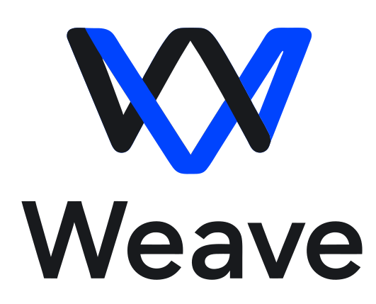

<p align="center">
<picture>
<source media="(prefers-color-scheme: dark)" srcset="docs/assets/weave-logo-dark.svg">

</picture>
</p>

<p align="center"><b>A lightweight real-time collaboration layer above Git.</b></p>

Weave lets two to five people — and their agents — work simultaneously on
independent local copies of the same Git repository while one authoritative host
maintains a single shared live state. Git keeps its ordinary role: durable history,
branch identity, remotes, portability.

```
Quentin / Codex ──┐
Alice / Codex ────┼────── Weave ────── shared live state
Bob / Codex ──────┘                        │
                                    semantic publication
                                           │
                                           ▼
                                          Git
```

Weave is a collaboration primitive, not an agent manager, an IDE, a Git
replacement, a CRDT platform or a distributed filesystem. Everyone runs their own
editor and their own agent; Weave only keeps the files in sync and turns the result
into ordinary Git commits when the team decides to publish.

- **CLI only.** One `weave` binary, Windows / macOS / Linux.
- **One authoritative host.** No P2P, no CRDT, no leader election.
- **No lost edits.** Weave never overwrites local bytes it has not already captured
  durably.
- **Explicit conflicts.** Independent edits merge; overlapping edits become a Weave
  conflict with every candidate preserved. The working tree never receives generated
  Git conflict markers.
- **Ordinary Git, always.** Remove Weave and the repository is still a normal,
  fully usable Git repository.

---

## Install

<table>
<tr>
<td align="center" width="33%">
<br>
<b>Windows</b><br><br>
<a href="https://github.com/Quentin-BRG/weave/releases/latest/download/WeaveSetup-x64.exe"></a><br>
<sub>Windows 10 / 11 · x64 · <code>.exe</code></sub>
</td>
<td align="center" width="33%">
<br>
<b>macOS</b><br><br>
<a href="https://github.com/Quentin-BRG/weave/releases/latest/download/Weave-macos-universal.pkg"></a><br>
<sub>Universal · Apple silicon &amp; Intel · <code>.pkg</code></sub>
</td>
<td align="center" width="33%">
<br>
<b>Linux</b><br><br>
<a href="https://github.com/Quentin-BRG/weave/releases/latest/download/weave-linux-x64.deb"></a><br>
<sub>Debian / Ubuntu · x64 · <code>.deb</code></sub>
</td>
</tr>
</table>

Each package installs the `weave` command, puts it on your `PATH`, and includes a
pinned copy of `cloudflared`. **You do not need Rust, Cargo, or a separate
`cloudflared` install.** Git is the only thing Weave expects you to already have.

Install, then go:

```bash
cd my-project
weave host
```

Weave checks the machine and the repository itself every time it starts. If
something is wrong it says so in one line and stops; otherwise it stays quiet.

<sub>Other architectures and previous versions → <a href="https://github.com/Quentin-BRG/weave/releases">Releases</a></sub>

<details>
<summary><b>Installed files, and how to remove them</b></summary>

**Windows** — `%LOCALAPPDATA%\Programs\Weave\` holds `weave.exe`,
`cloudflared.exe` and the third-party licences. The installer needs no
administrator rights and adds that directory to your user `PATH`. Remove it from
**Settings → Apps → Installed apps → Weave**.

**macOS** — `/usr/local/bin/weave` (a universal binary),
`/usr/local/libexec/weave/` (both `cloudflared` architectures, the bundle
manifest and licences) and `/usr/local/share/doc/weave/`. To remove:
`sudo rm -rf /usr/local/bin/weave /usr/local/libexec/weave /usr/local/share/doc/weave`
and `sudo pkgutil --forget com.github.quentin-brg.weave`.

**Linux** — `/usr/bin/weave`, `/usr/lib/weave/cloudflared`,
`/usr/share/doc/weave/`. Remove with `sudo apt remove weave`.

The portable `weave-linux-x64.tar.gz` unpacks to `bin/` and `lib/weave/` under a
prefix of your choosing and needs no package manager.

</details>

<details>
<summary><b>These builds are not code-signed</b></summary>

Weave has no code-signing certificate on any platform yet.

**Windows.** `WeaveSetup-x64.exe` is unsigned, so SmartScreen may show *"Windows
protected your PC"*. Choose **More info → Run anyway**.

**macOS.** `Weave-macos-universal.pkg` is **not signed with a Developer ID and
not notarized**. Gatekeeper blocks it on first double-click. Control-click the
package → **Open**, or approve it under **System Settings → Privacy &
Security** after the first attempt.

Every release publishes a `SHA256SUMS` file listing a SHA-256 digest for each
asset, which is what you can actually verify today:

```bash
shasum -a 256 -c SHA256SUMS --ignore-missing   # macOS
sha256sum -c SHA256SUMS --ignore-missing       # Linux
```

</details>

<details>
<summary><b>Build from source</b></summary>

Only needed to develop Weave. Building from source needs a recent **Rust stable**
toolchain and the **git** executable on PATH; a source build has no bundled
`cloudflared`, so remote hosting also needs `cloudflared` on `PATH` (or
`WEAVE_CLOUDFLARED` pointing at one). `weave host --lan` and `weave host --local`
need neither.

```bash
cargo install --path .
```

or build in place:

```bash
cargo build --release
# target/release/weave
```

The native packages are built by [`.github/workflows/release.yml`](.github/workflows/release.yml);
see [packaging/README.md](packaging/README.md).

</details>

<details>
<summary><b>Something is wrong</b></summary>

```bash
weave doctor            # everything: machine, installation and this repository
weave doctor --install  # the installation only; works outside a Git repository
weave doctor --json     # the same reports, machine-readable
```

`weave doctor` is a troubleshooting command, not a setup step — the installers
already run `weave doctor --install`, and `weave host` / `weave join` run the
checks they need on their own.

</details>

---

## Quick start

### Host a session

From a clean repository with a checked-out branch:

```bash
weave host
```

Weave prints an invite:

```
weave2_eyJ2IjoyLCJ1Ijoi...
```

Share it over a channel you trust — **the invite grants full read/write access to
the session.** Other options:

```bash
weave host --lan     # local network, no Cloudflare process
weave host --local   # this machine only, no remote endpoint
```

`--lan` changes where the socket lives, not how it is protected: LAN participants
run the same encrypted handshake as remote ones.

### Join a session

You must already have a checkout of the same repository, clean, on the same branch,
at the session base commit. Weave does not clone.

```bash
weave join
Paste Weave invite:
> ‹hidden›
```

For automation:

```bash
weave join --invite-file invite.txt
weave join --invite-stdin < invite.txt
```

### Work

Just edit files. Codex, Claude Code, VS Code, `sed`, a formatter — Weave does not
care which process wrote the file.

```bash
weave status
weave peers
```

### Describe intent

```bash
weave task start --description "Rewrite the pricing slide" --file slides/07-pricing.tsx
weave task list
weave task complete <id>
```

Task scopes are **advisory soft locks**. They tell collaborators "Alice is working
here"; they never prevent anyone from editing.

### Resolve a conflict

```bash
weave conflict list
weave conflict show C-8F21     # writes every candidate to .git/weave/conflicts/
# edit the working file into one coherent result
weave conflict resolve C-8F21
```

### Publish to Git

```bash
weave commit prepare --json
weave commit create <prepare_id> --message "docs: refine market narrative"
weave push          # only if the automatic push did not succeed
```

`commit prepare` binds the publication to one immutable live revision and runs a
short barrier so nothing in flight is missed. Live editing continues afterwards; the
prepared commit still represents the revision it was bound to.

---

## The rule that matters most

**While a Weave session is active, Weave owns every Git-writing operation** — for
the host and for participants alike.

Do not run `git add`, `commit`, `pull`, `push`, `merge`, `rebase`, `cherry-pick`,
`reset`, `checkout`, `switch` or `stash`. Weave detects Git state changed outside
itself and pauses synchronization until the expected state is restored; it will
never pull, merge or rebase on your behalf.

Read-only Git stays available and useful: `git status`, `git diff`, `git log`,
`git show`.

---

## Agents

The agent skills for Weave live in their own repository:

### **https://github.com/Quentin-BRG/weave-plugin**

It ships four provider-neutral skills — collaboration, Tasks, conflicts, Git
publication — as a portable
[Agent Plugins v1.0.0](https://agent-plugins.org/specification) package, with a
Codex packaging and marketplace layer wrapped around the same skills. There is **no
MCP server**; the CLI in this repository is the entire protocol surface.

They are kept separate because they version and install on their own schedule: the
plugin is instructions about a CLI, this repository is the CLI.

For a permanent, agent-independent activation hook that needs no plugin at all,
write the managed block into the
repository's `AGENTS.md`:

```bash
weave agent bootstrap
```

The block says "check `weave status`; if a session is active, follow Weave", so it
can stay committed forever and never needs updating when a session starts or stops.
It never overwrites unrelated instructions.

---

## Command reference

| Command                                             | Purpose                                                   |
| --------------------------------------------------- | --------------------------------------------------------- | ---------------------------------- | ------------------------- | ---------------------------------- | ------- | -------------------- |
| `weave host [--lan                                  | --local]`                                                 | Host a session (long-lived daemon) |
| `weave join [--invite-file                          | --invite-stdin]`                                          | Join a session (long-lived daemon) |
| `weave resume`                                      | Resume this repository's session after a crash or restart |
| `weave leave`                                       | Leave the session and forget its local record             |
| `weave stop`                                        | Stop the daemon, keeping the session record               |
| `weave status [--json]`                             | Live session state                                        |
| `weave peers [--json]`                              | Participants and presence                                 |
| `weave invite [--json]`                             | Reprint the invite (host)                                 |
| `weave rescan [--json]`                             | Force a full repository rescan                            |
| `weave task start                                   | list                                                      | show                               | update                    | complete                           | cancel` | Tasks and soft locks |
| `weave conflict list                                | show                                                      | resolve                            | dismiss`                  | Conflict inspection and resolution |
| `weave commit prepare` / `weave commit create <id>` | Git publication                                           |
| `weave push`                                        | Ask the host to push                                      |
| `weave tunnel restart`                              | Replace a dead Quick Tunnel, same session                 |
| `weave agent bootstrap`                             | Manage the `AGENTS.md` block                              |
| `weave doctor [--install]`                          | Troubleshooting: environment, installation, repository    |
| `weave recover [--rebuild] [--export DIR]`          | Integrity diagnostics and safe recovery                   |
| `weave config list                                  | get                                                       | set`                               | Local Weave configuration |

Every command an agent drives supports `--json`: stable field names, no prompts,
machine-readable result on stdout, diagnostics on stderr, meaningful exit codes.

---

## What Weave refuses

Weave V1 rejects repositories using Git submodules, Git LFS, sparse checkouts,
secondary worktrees, tracked symlinks, gitlinks, custom clean/smudge filters or
`working-tree-encoding`. It enforces a portable filename subset so Windows, macOS
and Linux participants can hold the same working tree. `weave host` and
`weave join` refuse such a repository before starting, and `weave doctor` lists
everything at once.

A session also carries a file size limit — 128 MiB by default, set with
`weave host --max-file-size <size>` and changed later with `weave limit set
<size>`. It is a resource budget, not a protocol constraint: the host uploads
every change to every participant over one uplink. A repository already holding a
file above it will not start a session, and a file that goes above it during one
is left exactly as it is, shown to everybody, and blocks Git publication until it
is shrunk, deleted, or the limit is raised. Nothing is ever partially
synchronized.

---

## Tests

```bash
cargo test -- --test-threads=1
```

The end-to-end tests drive the real binary against real Git repositories, so they
spawn daemons and bind loopback sockets and must run one at a time.

One test leaves the machine: `tests/remote_tunnel.rs` runs a whole session over a
real Cloudflare Quick Tunnel — join from a `wss://…trycloudflare.com` invite,
bidirectional sync, Tasks, a conflict, a participant-requested publication, a
disconnect, and `weave tunnel restart`. It needs `cloudflared` and outbound HTTPS,
so it is opt-in:

```bash
cargo test --test remote_tunnel -- --ignored --test-threads=1 --nocapture
```

## Documentation

- [docs/ARCHITECTURE.md](docs/ARCHITECTURE.md) — how the pieces fit together
- [docs/PROTOCOL.md](docs/PROTOCOL.md) — the wire protocol and reconciliation rules
- [docs/CLI.md](docs/CLI.md) — every command, flag and JSON shape
- [docs/SECURITY.md](docs/SECURITY.md) — the security model and its limits
- [docs/SPEC-COVERAGE.md](docs/SPEC-COVERAGE.md) — where each specification section lives

---

## Security in one paragraph

Possession of the session secret grants full collaborative read/write authority over
the repository for the duration of the session. There are no user accounts, no
fine-grained authorization and no per-file permissions. The session itself is
encrypted end to end between the host and each participant with a standard Noise
handshake (`Noise_NNpsk0_25519_ChaChaPoly_BLAKE2s`) keyed by a value derived from
the session secret, so the Cloudflare tunnel that carries remote traffic — which
still runs over `wss://` with full certificate verification — sees connection
metadata and ciphertext, never repository content. That protects the channel, not
the collaborators from each other: every participant sees plaintext by design, and
so does anyone who obtains the invite. Read [docs/SECURITY.md](docs/SECURITY.md)
before using Weave with anything sensitive.

---

## Acknowledgements

Weave was co-designed and co-developed with the assistance of
GPT-5.6 Sol by OpenAI and Claude Opus 5 by Anthropic.

---

## License

Mozilla Public License 2.0. See [LICENSE](LICENSE).
